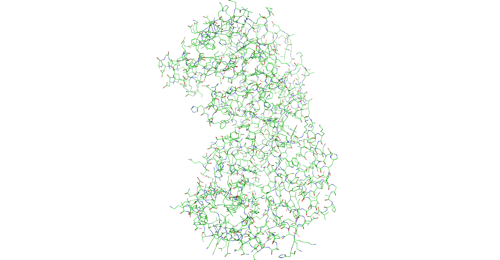
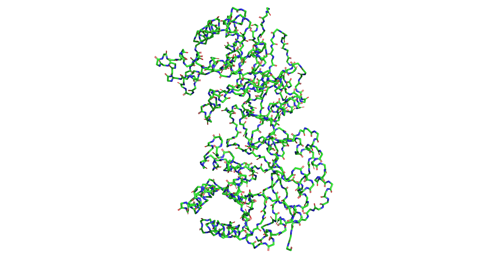
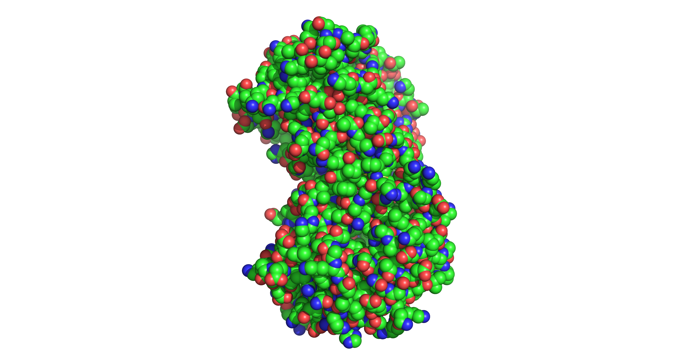
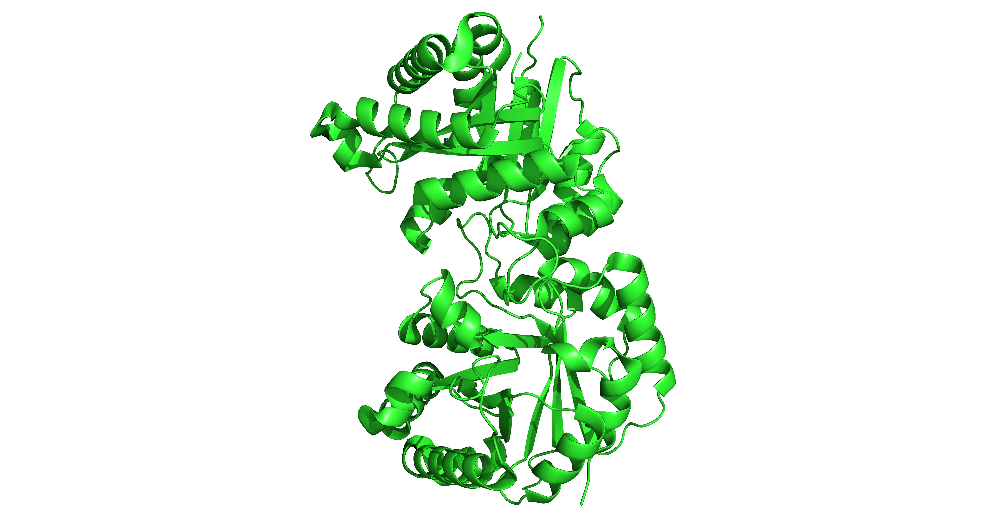
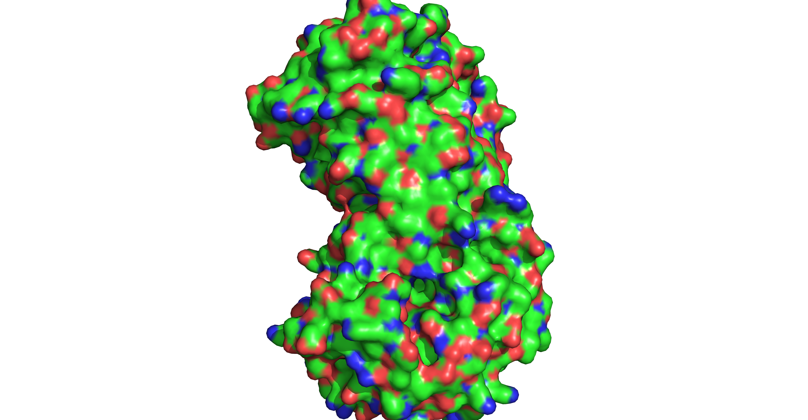
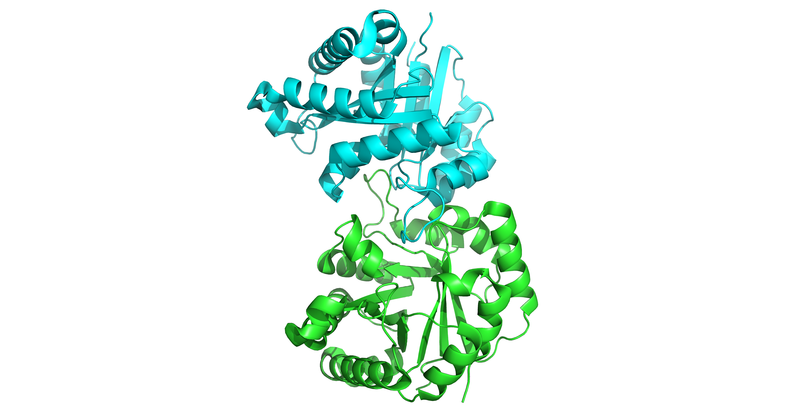
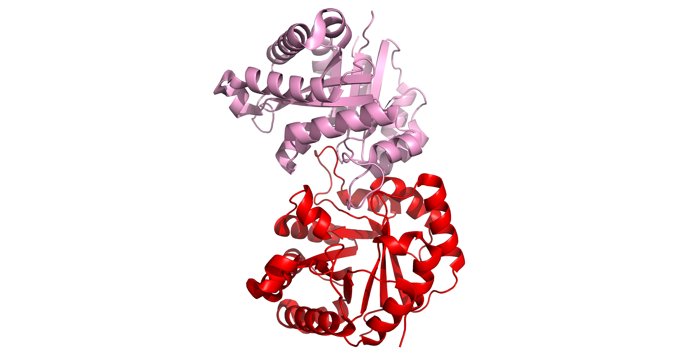

Используемое ПО: PyMOL
Выбранная структура: https://www.rcsb.org/structure/1TIM

1) Wireframe
```pymol
hide everything
show lines, all
ray 4000,2080
png wireframe.png, dpi=300
```



2) Backbone
```pymol
hide everything
show backbone, all
ray 4000,2080
png backbone.png, dpi=300
```



3) Spacefill
```pymol
hide everything
show spheres, all
set sphere_scale, 0.3
util.cbc
ray 4000,2080
png spacefill.png, dpi=300
```


4) Ribbons
```pymol
hide everything
show cartoon, all
util.cbc
ray 4000,2080
png ribbons.png, dpi=300
```


5) Molecular Surface
```pymol
hide everything
show surface, all
color gray70, all
ray 4000,2080
png surface.png, dpi=300
```


6) CPK
```pymol
util.cbc
ray 4000,2080
png cpk_coloring.png, dpi=300
```


7) Domains coloring
```pymol
color red, chain A
color blue, chain B
color green, chain C
ray 4000,2080
png domain_coloring.png, dpi=300
```
